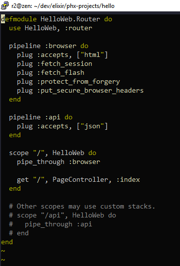
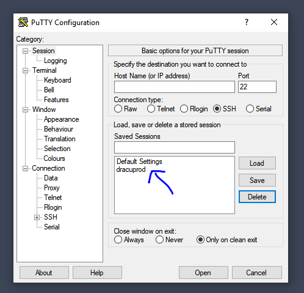

# putty-vim-production-defaults
These repositories aim to provide production ready color scheme defaults for both Putty &amp; Vim

The vim colorscheme paragold.vim is based on paramount.vim. It is a minimal theme which intends to focus on what matters. The main difference between paramount and paragold is the main highlight color, which is gold-yellow instead of purple.

### How to install paragold.vim colorscheme for vim on Linux###

1. Just copy paragold.vim into "colors" directory in your ~/.vim/colors and put paragold.vim inside it. If the "colors" directory does not exist, create it.

2. Then open .vimrc in your $HOME directory and add the following lines:

```
"If you don't see colors on putty write this line:
set t_Co=256

"Informing the system that the Putty background is black
set background=dark

"All the following are optional and my personal preference. I prefer 2 spaces for a single tab during development.
set tabstop=2
set shiftwidth=2
set expandtab
```
This is a screenshot of how the syntax looks on paragold. Comments easy on the eyes, language keywords contrasted a bit, and values highlighted even more, allowing focus on work and high productivity. 



### How to install dracuprod Putty colorscheme and better defaults ###

Dracuprod is a Putty colorscheme based on Dracula color scheme with some minor changes and enhancements for better visibility. To install it double click on dracuprod.reg and a new record will be added into Putty.exe as follows.



I have carefully chosen the settings that makes my Putty.exe ready for development. I hope you enjoy the default settings made and let me know if there are any suggestions.
